# Challenge #1

## Step 1: Move historic data from files in CSV format to the new database.

To store the CSV files of the historical data, you will use Azure Blob storage.

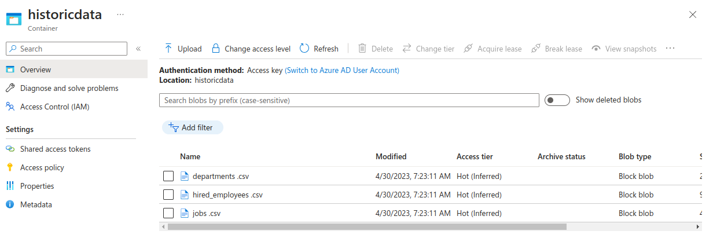  

### Create new DB

An Azure SQL instance has been created where the data from the CSV files and the new transactions will be stored. Furthermore, tables were created with the following script:

```sql 

CREATE TABLE Department (
    Id int NOT NULL,
    Department varchar(255),
    CONSTRAINT PK_DepartmentId PRIMARY KEY (Id),
);

CREATE TABLE Job (
    Id int NOT NULL,
    Job varchar(255),
    CONSTRAINT PK_JobId PRIMARY KEY (Id),
);

CREATE TABLE Employee (
    id int NOT NULL,
    Name VARCHAR(200) NOT NULL,
    DateTime VARCHAR(200) NOT NULL,
    DepartmentId int NOT NULL,
    JobId int,
    CONSTRAINT PK_Employee PRIMARY KEY (Id),
    CONSTRAINT FK_DepartmentId FOREIGN KEY (DepartmentId) REFERENCES Department(Id),
    CONSTRAINT FK_JobId FOREIGN KEY (JobId) REFERENCES Job(Id)
);

CREATE INDEX idx_id_deparment ON Employee (DepartmentId);
CREATE INDEX idx_id_job ON Employee (JobId);
```
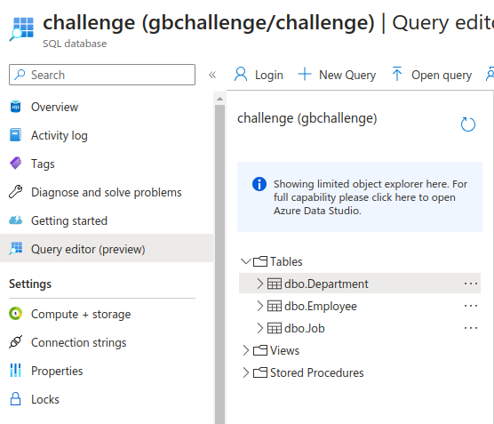  

### Import historic data to AzureSQL

For this task, we will use Azure Data Factory to create a pipeline that inserts data from CSV files into the Azure SQL database that we previously created.

#### DataFLows: 

* Load_Jobs_Data
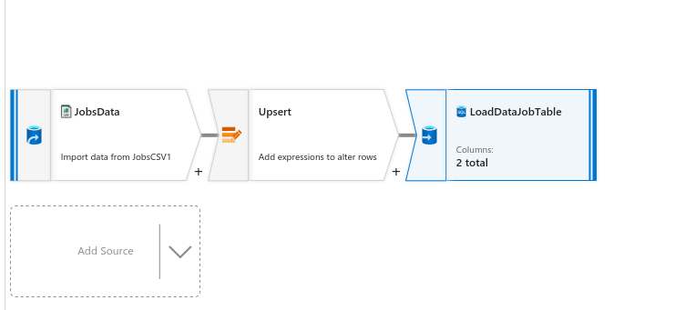  
* Load_Deparmets_Data
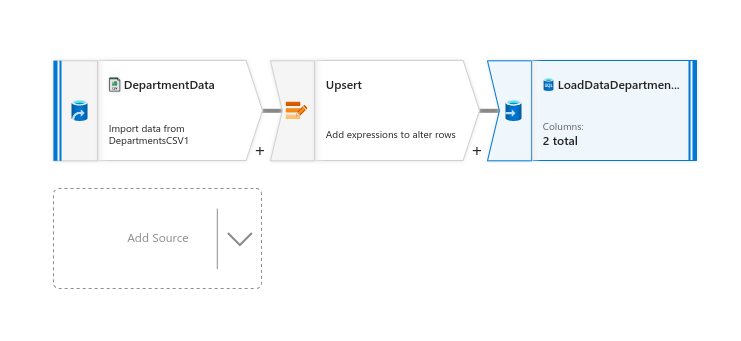  
* Load_Deparmets_Data
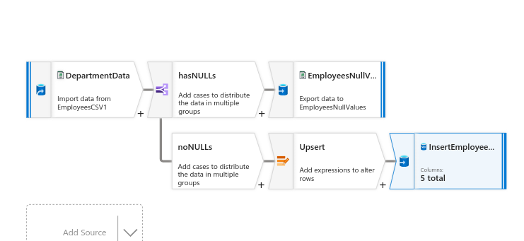 

#### Pipelines: 
* Load_Historic_Data_pipeline
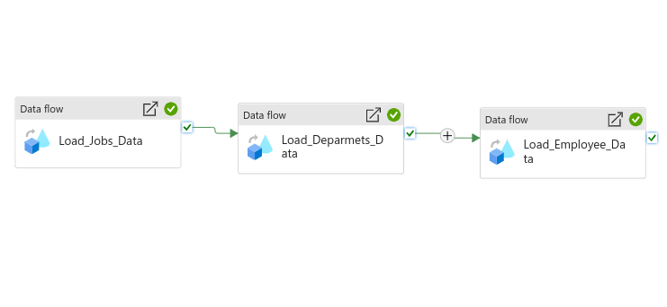 
> **Note**:  
The Departments CSV had null values in all the columns. Following the indications, these rows are ignored and saved in a.csv file in the blob _igestion-errors_ container blog storage.
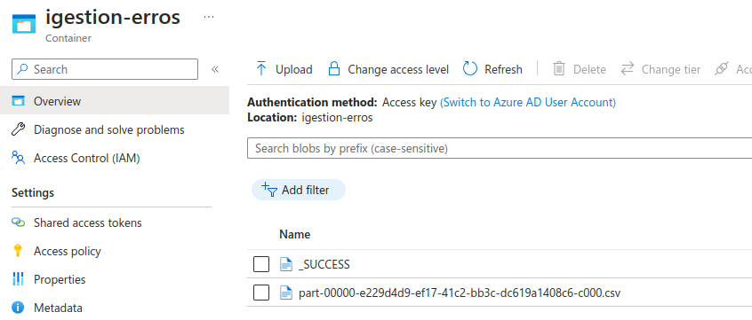 

## Step 2: Create a Rest API service to receive new data.
##### Run docker api service and DB

```bash
docker compose -f "docker-compose.yml" up -d --build 
```
> **Note**:  
The creation of the API container may be faster than that of Postgres, which can cause a connection error during startup. If this happens, simply restart the API container.


##### Use the following link to see the end points doc
```
http://localhost:8000/docs
```
> **Note**:  
The local database is empty. Please use the uploadcsv endpoints for each table to upload the data from the CSV files to the database.

```
src
 ┣ __pycache__
 ┃ ┣ __init__.cpython-310.pyc
 ┃ ┗ main.cpython-310.pyc
 ┣ db
 ┃ ┣ __pycache__
 ┃ ┃ ┣ __init__.cpython-310.pyc
 ┃ ┃ ┣ database.cpython-310.pyc
 ┃ ┃ ┣ db_department.cpython-310.pyc
 ┃ ┃ ┣ db_employee.cpython-310.pyc
 ┃ ┃ ┣ db_job.cpython-310.pyc
 ┃ ┃ ┣ db_kpis.cpython-310.pyc
 ┃ ┃ ┗ models.cpython-310.pyc
 ┃ ┣ __init__.py
 ┃ ┣ database.py
 ┃ ┣ db_department.py
 ┃ ┣ db_employee.py
 ┃ ┣ db_job.py
 ┃ ┣ db_kpis.py
 ┃ ┗ models.py
 ┣ routers
 ┃ ┣ __pycache__
 ┃ ┃ ┣ __init__.cpython-310.pyc
 ┃ ┃ ┣ department.cpython-310.pyc
 ┃ ┃ ┣ employee.cpython-310.pyc
 ┃ ┃ ┣ job.cpython-310.pyc
 ┃ ┃ ┣ kpis.cpython-310.pyc
 ┃ ┃ ┗ schemas.cpython-310.pyc
 ┃ ┣ __init__.py
 ┃ ┣ department.py
 ┃ ┣ employee.py
 ┃ ┣ job.py
 ┃ ┣ kpis.py
 ┃ ┗ schemas.py
 ┣ Dockerfile
 ┣ __init__.py
 ┣ main.py
 ┗ requirements.txt
```

####  All end points
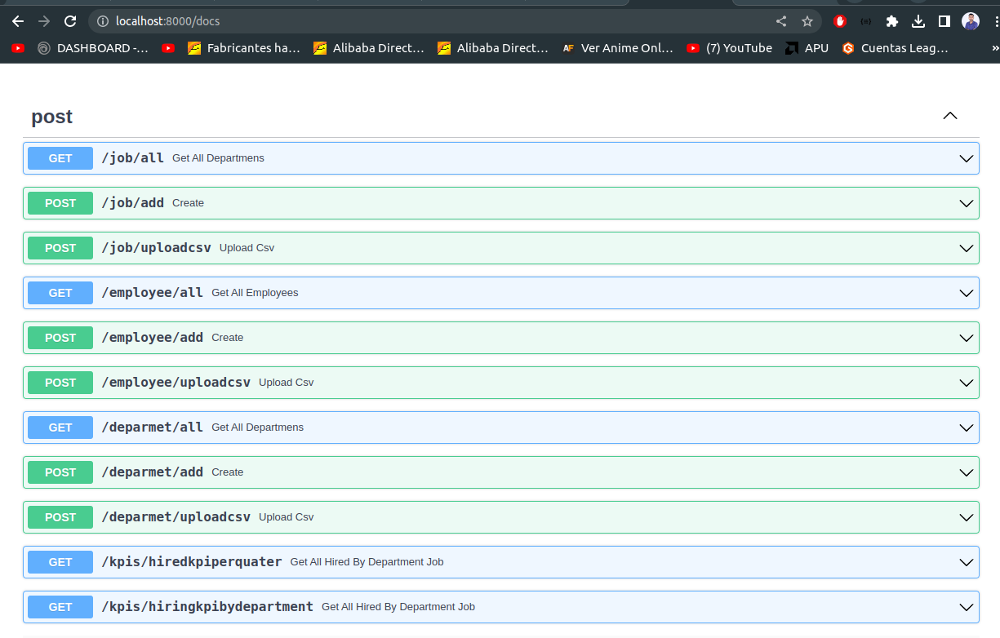

#### Results example
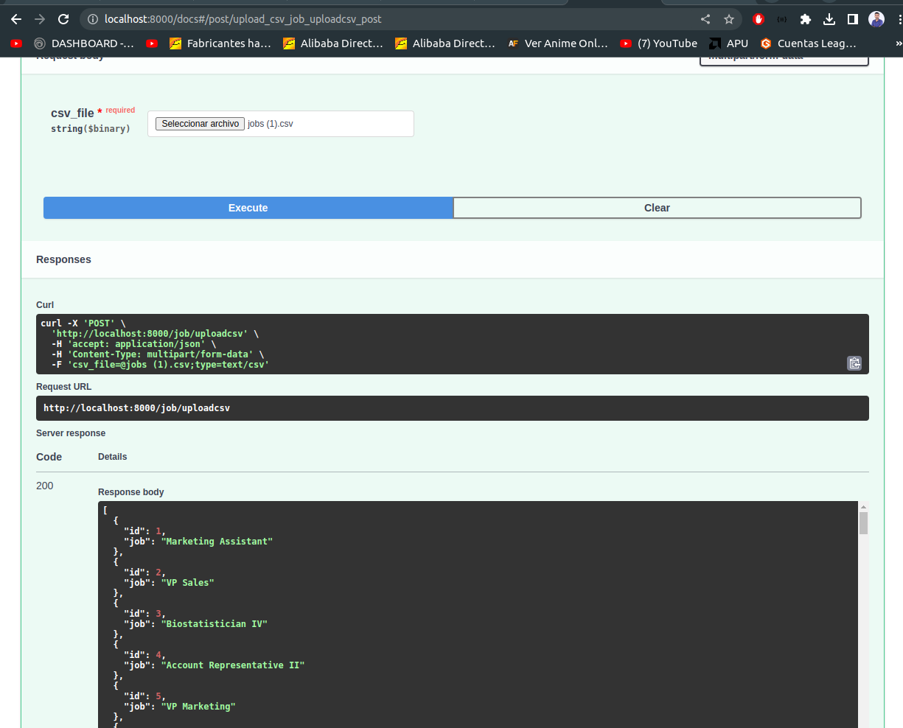 


## Step 3: Create a feature to backup for each table and save it in the file system in AVRO format.
An Azure Data Factory pipeline has been created to back up the database. This pipeline exports all the data from each table and saves it in an AVRO file for each table, storing them in a Blob storage container. This pipeline is scheduled to run once a month.

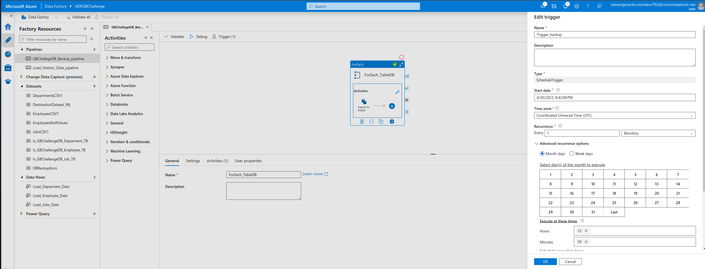 

* **Blob storage container for backups**

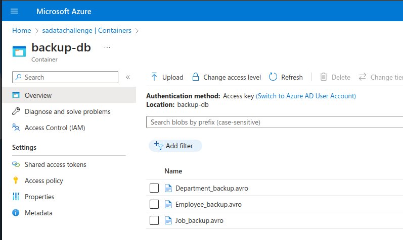 

## Step 4: Create a feature to restore a certain table with its backup.


# Challenge #2

##### List of ids, name and number of employees hired of each department that hired more employees than the mean of employees hired in 2021 for all the departments, ordered by the number of employees hired (descending).
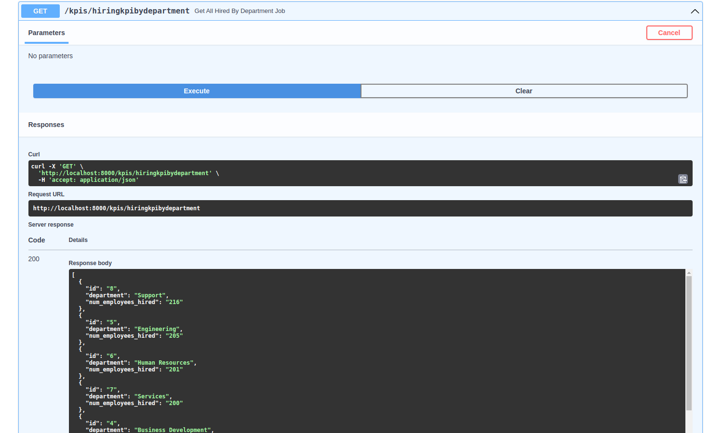 

##### Number of employees hired for each job and department in 2021 divided by quarter. The table must be ordered alphabetically by department and job.
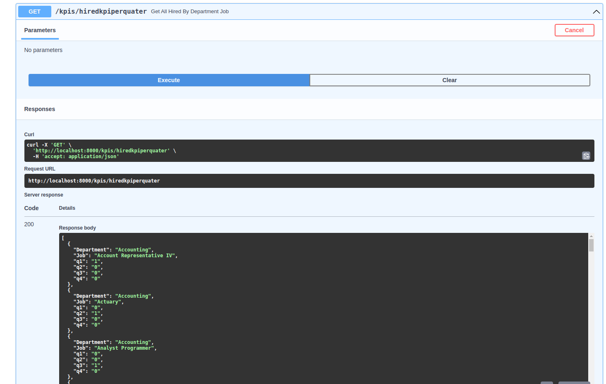 


